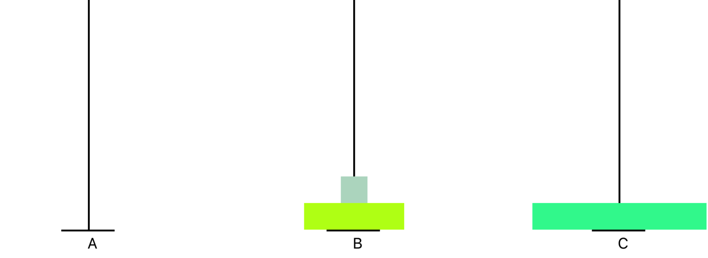
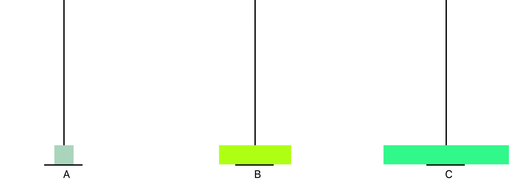
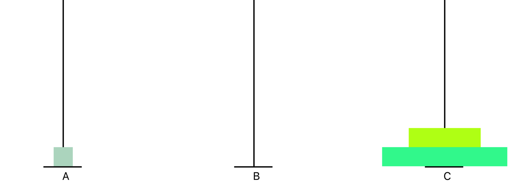
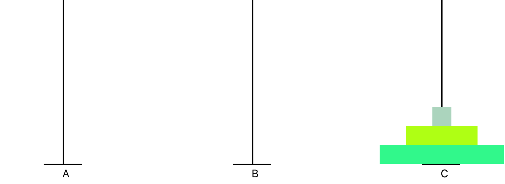

 法国数学家爱德华·卢卡斯曾编写过一个印度的古老传说：在世界中心贝拿勒斯（在印度北部）的圣庙里，一块黄铜板上插着三根宝石针。印度教的主神梵天在创造世界的时候，在其中一根针上从下到上地穿好了由大到小的64片金片，这就是所谓的汉诺塔。不论白天黑夜，总有一个僧侣在按照下面的法则移动这些金片：一次只移动一片，不管在哪根针上，小片必须在大片上面。僧侣们预言，当所有的金片都从梵天穿好的那根针上移到另外一根针上时，世界就将在一声霹雳中消灭，而梵塔、庙宇和众生也都将同归于尽。

### 图示
 


### 规则

  - 每次只能移动一个金片
  - 不允许将较大的金片压在较小的金片上面
  - 在满足规则一、规则二的情况下，可将圆盘移动到A,B,C中任一塔座上


### 算法分析

 - 无论盘子的个数有多少个，为了完成任务，在移动的过程中，将始终会出现如下的状态

  

 - 接着把绿色(第N个)盘子移动到C塔

  

 - 再接下来是把N-1个盘子移动到C塔，问题似乎回到了原点，只是盘子数量变成了N-1，这里有很明显递归关系

 

 

 


### 基本思路

  - 设初始盘子个数为N
  - 若A塔上仅仅只有一个盘子(N=1)，则直接从A移动到C，问题完全解决
  - 若塔上有多于一个盘子(N>1)，则把N-1盘子移动到缓冲区，
  - 将剩下的第N个盘子(也就是最底下的一个)直接从A塔叠放到C塔上
  - 用第一步的方法，再次将缓冲区塔上的所有盘子叠放到C塔上

### 算法实现

 ```
void Hanoi(int n, char a, char b, char c)
{
    if (n == 1)
    {
        Move(n, a, c);
    }
    else
    {
        Hanoi(n - 1, a, c, b);
        Move(n, a, c);
        Hanoi(n - 1, b, a, c);
    }
}

void Move(int n, char a, char b)
{
    count++;
    printf("第%d次移动 Move %d: Move from %c to %c !\n",count,n,a,b);
}
 ```
 - 要从a到b，那c就是缓冲，Hanoi(n - 1, a, c, b)
 - 把n移动到c， Move(n, a, c);
 - 要从b到c，那a就是缓冲，Hanoi(n - 1, b, a, c)

### 时间复杂度

  ```
  O(2^n)    
  ```


