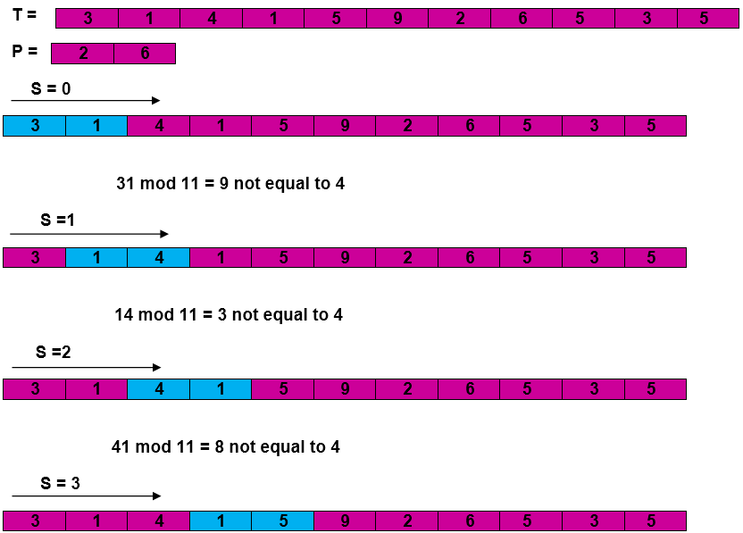
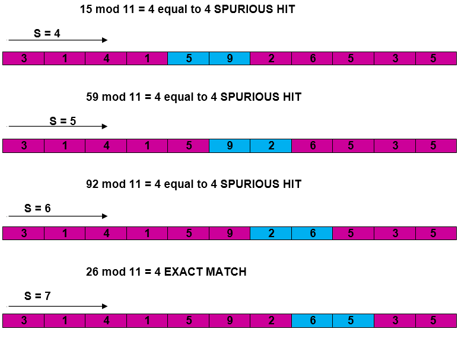
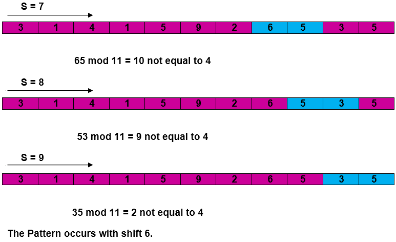

### [Markup](https://developer.apple.com/library/archive/documentation/Xcode/Reference/xcode_markup_formatting_ref/AddingMarkup.html#//apple_ref/doc/uid/TP40016497-CH100-SW1)

### [The Rabin-Karp-Algorithm](https://www.geeksforgeeks.org/rabin-karp-algorithm-for-pattern-searching/)


---


## Rabin-Karp算法概述

---

 Michael O. Rabin和Richard M. Karp在1987年提出一个想法，即可以对模式串进行哈希运算并将其哈希值与文本中子串的哈希值进行比对。总的来说这一想法非常浅显，唯一的问题在于我们需要找到一个哈希函数 ，它需要能够对不同的字符串返回不同的哈希值。例如，该哈希函数可能会对每个字符的ASCII码进行换算，但同时我们也需要仔细考虑对多语种文本的支持。我们唯一需要的就是将一个字符串（模式串）转化成为能够快速进行比较的哈希值。

### 基本思想
  - 假设子串的长度为M,目标字符串的长度为N
  - 计算子串的hash值
  - 计算目标字符串中每个长度为M的子串的hash值（共需要计算N-M+1次）
  - 比较hash值
  - 如果hash值不同，字符串必然不匹配，如果hash值相同，还需要使用朴素算法再次判断

### 看图说话

```swift
 P的哈希值：26 mod 11 = 4 
```

  
  
  

### 时间复杂度

由于哈希函数无法保证对不同的字符串产生不同的哈希值，有哈希冲突的现象存在，所以即使模式串的哈希值和文本子串的哈希值相等，也需要对这两个长度为m的字符串进行额外的比对（当然，如果不相等也就不用比对了，其实大部分的时间省在这上面），这时比对的开销是O(m)

+ _**最坏**_ 的情况

  文本中所有长度为m的子串(一共n-m+1个)都和模式串匹配，所以算法复杂度为O((n-m+1)m)

  ```swift
  let txt = "AAAAAAAAAAAAAAAAAA"
  let pat = "AAAAA" 
  ```

+ _**实际**_ 的情况

  实际情况下，需要进一步比对的子串个数总是有限的（假设为c个），那么算法的期望匹配时间就变成O((n-m+1)+cm)=O(n+m)
  
  ```swift
  let txt = "AAAAABBBBBBBBB"
  let pat = "AAAAA" 
  ```


